# 📋 To-Do App

A cross-platform **To-Do List application** built with [Go](https://go.dev/) and [Wails](https://wails.io/).  
It supports **task management with priorities, deadlines, filtering, sorting, dark/light theme**, and **SQLite/PostgreSQL** as a storage backend.

---

## 🚀 Features

- ✅ Add, edit, toggle, and delete tasks
- ⏳ Deadlines with date and time
- ⭐ Priority levels (Low, Medium, High)
- 🔍 Filtering by:
    - Status (All / Active / Done)
    - Deadline (Today / This week / Overdue)
- 📑 Sorting by creation date or priority
- 🎨 Light/Dark theme toggle
- ⚡ Cross-platform support (Windows, macOS, Linux)
- 🗄️ Database:
    - Local development with **SQLite**

---

## 📂 Project Structure

---

## ⚙️ Installation & Running

### 1. Prerequisites
- [Go 1.21+](https://go.dev/dl/)
- [Node.js 18+](https://nodejs.org/)
- [Wails v2](https://wails.io/docs/gettingstarted/installation)

### 2. Clone the project
```bash
git clone https://github.com/your-username/to-do-app.git
cd to-do-app
```

### Run in development mode
``` bash    
wails dev
```

### Build for production
```bash
wails build
```
---

##  Checklist
1. Интерфейс пользователя (25 баллов)

- Основная часть (15 баллов):
  - Создать интерфейс с текстовым полем для ввода новой задачи.
  - Добавить кнопку для добавления задачи в список.
  - Отображать список всех задач на экране.
  - Использовать CSS для стилизации интерфейса.
  - Использовать значки или цвета для обозначения выполненных и невыполненных задач.
- Бонусная часть (10 баллов):
  - Адаптивная верстка (чтобы корректно смотрелось при изменении размера окна).
  - Возможность переключения светлой/тёмной темы.
  
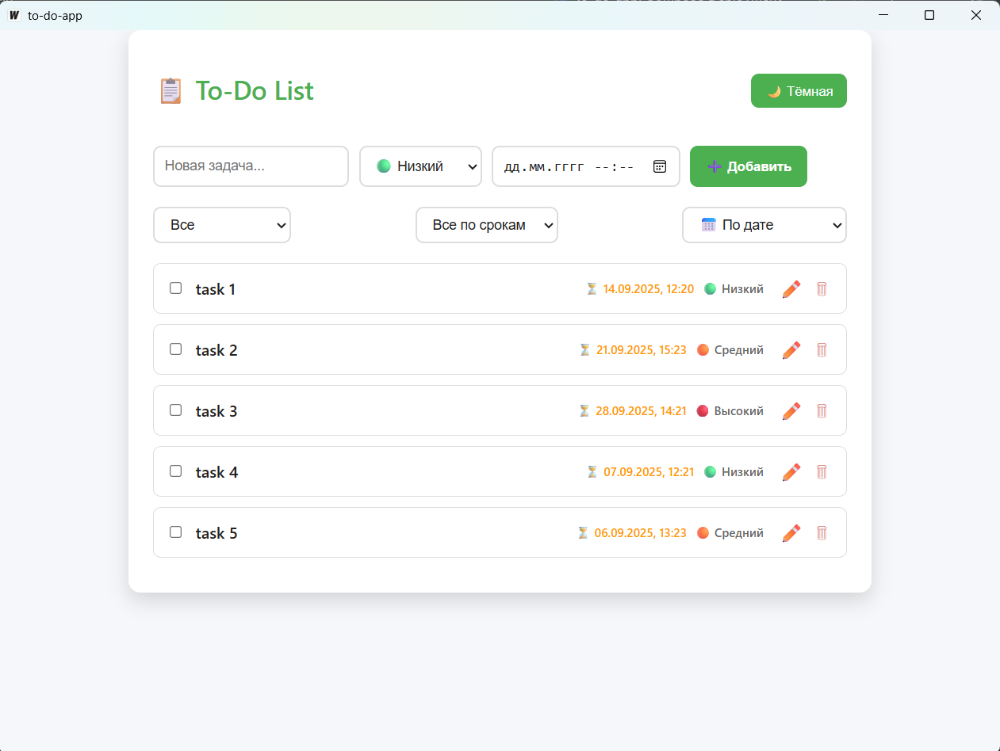
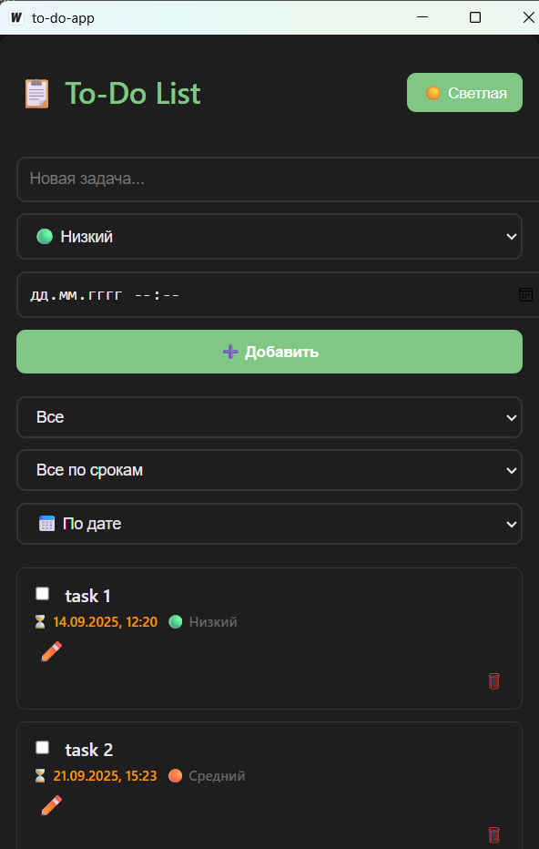

2. Добавление задач (20 баллов)
- Основная часть (10 баллов):
  - Реализовать функционал добавления новой задачи в список.
  - Валидация ввода (проверка на пустой ввод).
- Бонусная часть (10 баллов):
  - Возможность добавлять задачи с датой и временем выполнения.
  - Установка приоритета задачи (низкий, средний, высокий).
  
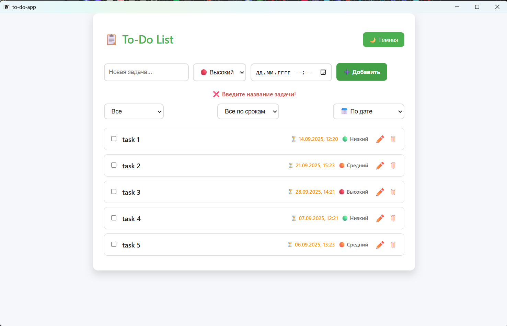
3. Удаление задач (15 баллов)

- Основная часть (5 баллов):
  - Реализовать возможность удаления задач из списка.
- Бонусная часть (10 баллов):
  - Добавить подтверждение удаления задачи (модальное окно).

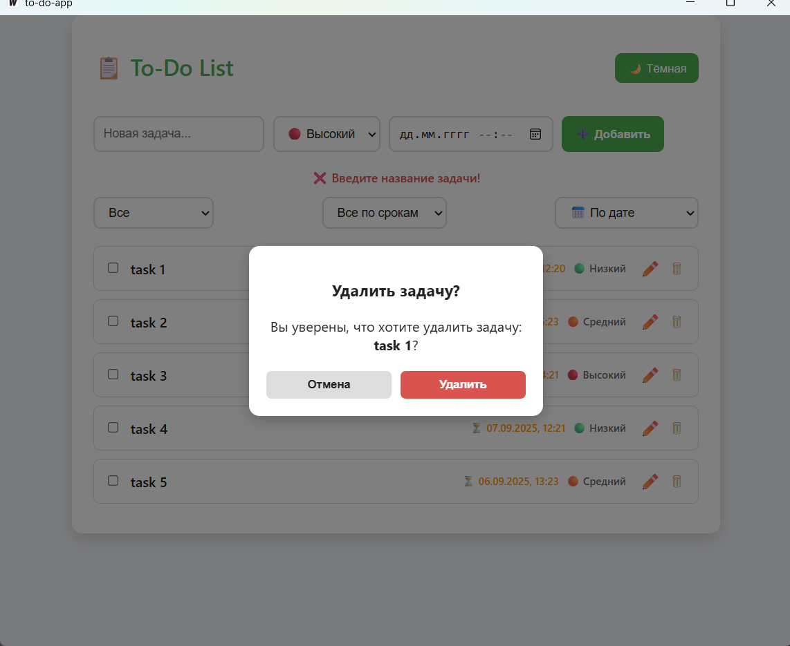

4. Управление выполнением задач (30 баллов)
- Основная часть (10 баллов):
  - Реализовать возможность отметки задачи как выполненной.
  - Зачеркивание текста выполненных задач.
- Бонусная часть (20 баллов):
  - Перемещение выполненных задач в отдельный раздел «Выполненные задачи».
  - Возможность отмены отметки выполнения задачи (возврат в «Активные задачи»).

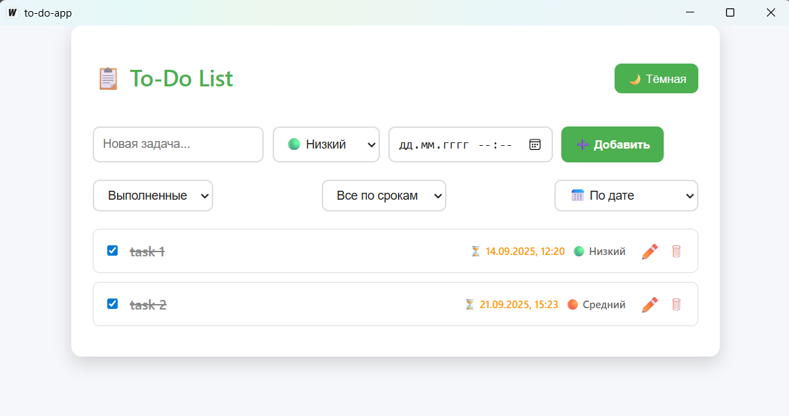
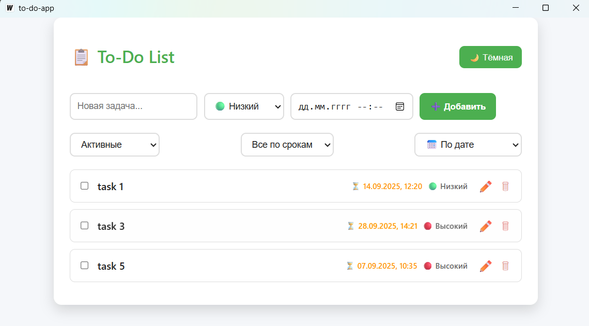

5. Сохранение состояния (50 баллов)

- Основная часть (20 баллов):
  - Сохранение состояния задач при закрытии приложения.
  - Загрузка состояния задач при запуске приложения.
- Бонусная часть (30 баллов):
  - Использование PostgreSQL для хранения задач.Заменил на SQLite для локального хранения данных
  - Создать и использовать repo → service → usecase слои для работы с данными.

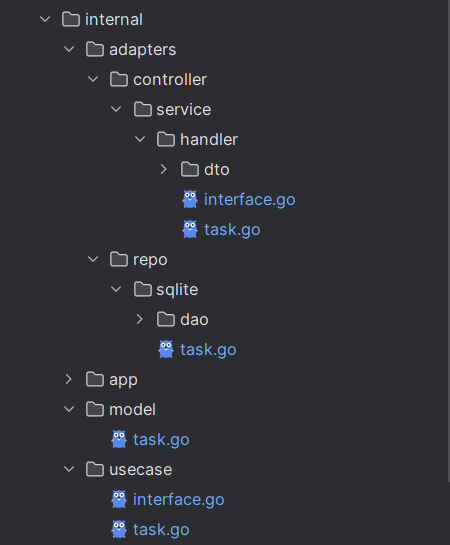
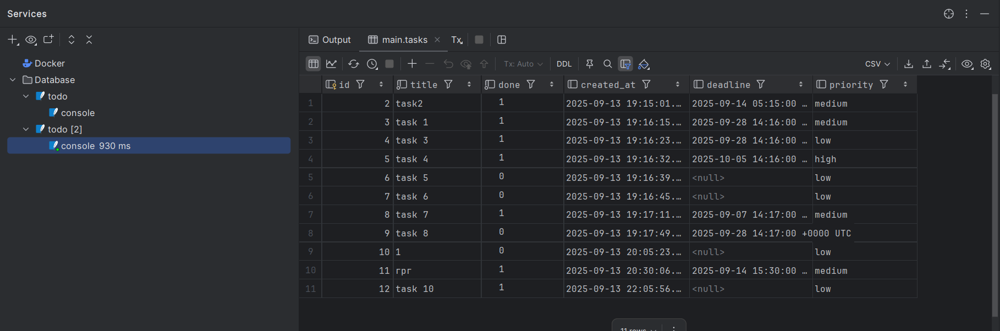

6. Фильтрация и сортировка задач (20 баллов)
- Основная часть (10 баллов):
  - Фильтрация задач по статусу (все / активные / выполненные).
  - Сортировка по дате добавления.
- Бонусная часть (10 баллов):
  - Сортировка по приоритету.
  - Фильтрация по дате (сегодня / на неделю / просроченные).

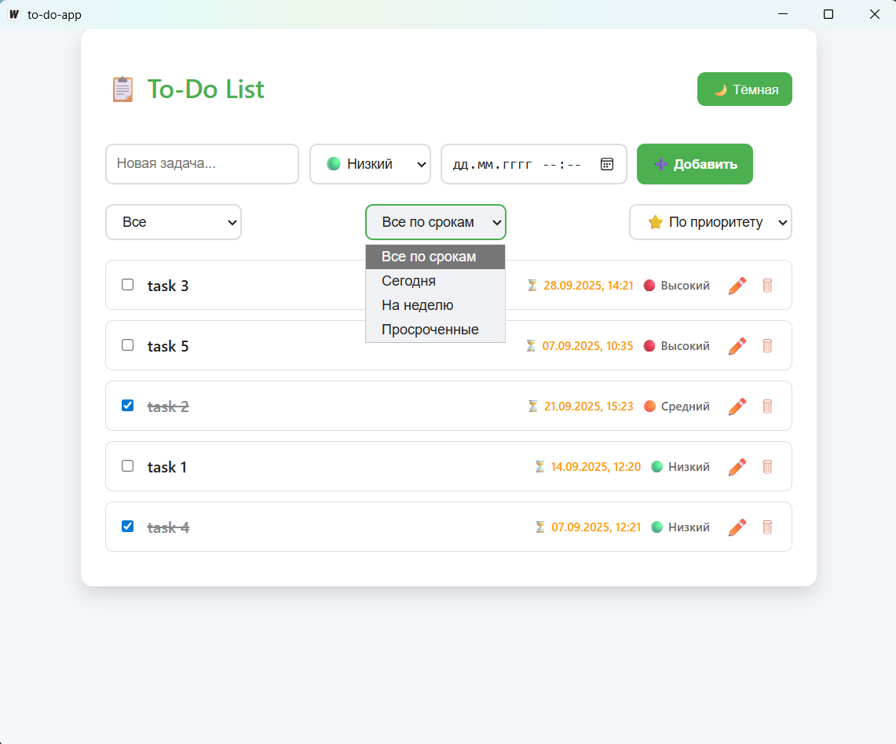
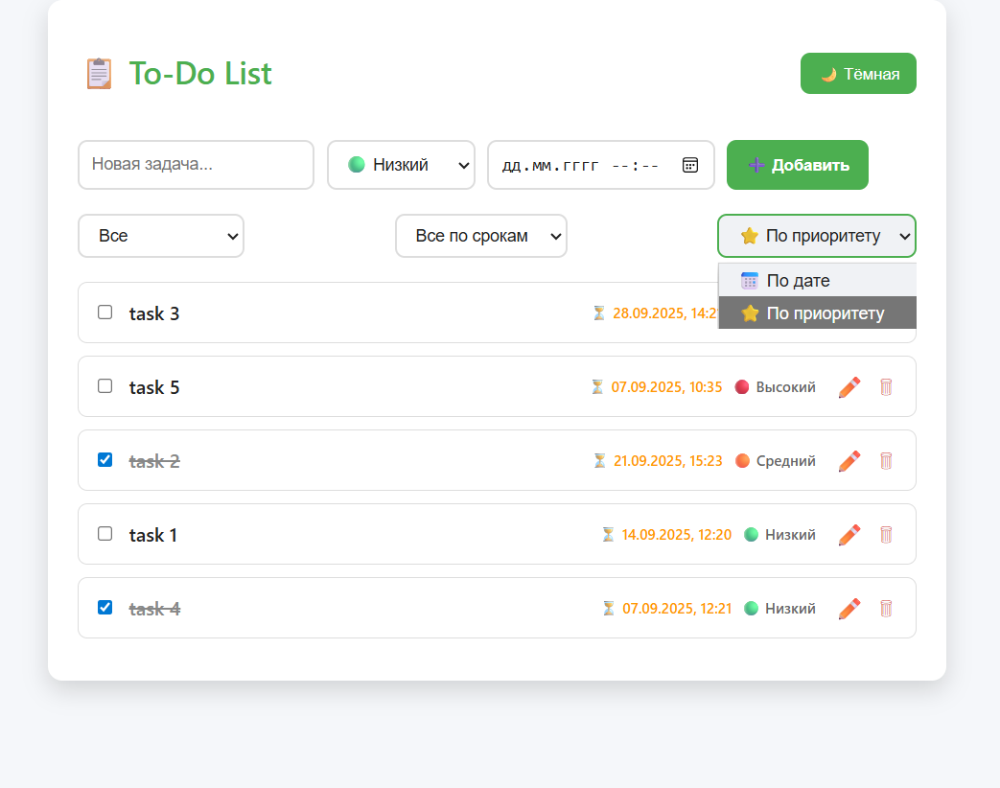
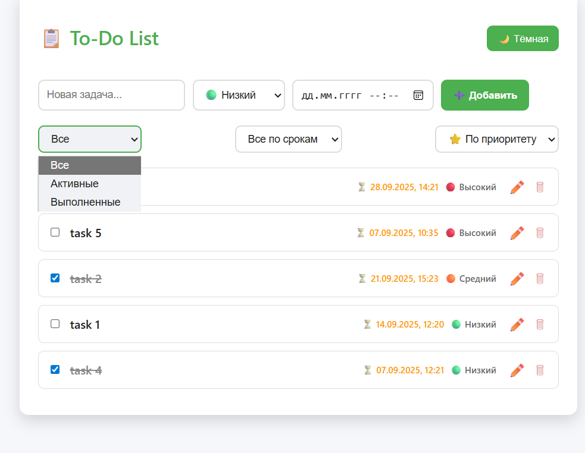


## 📜 License
- MIT License.
- Author: Yernar Bukembay


